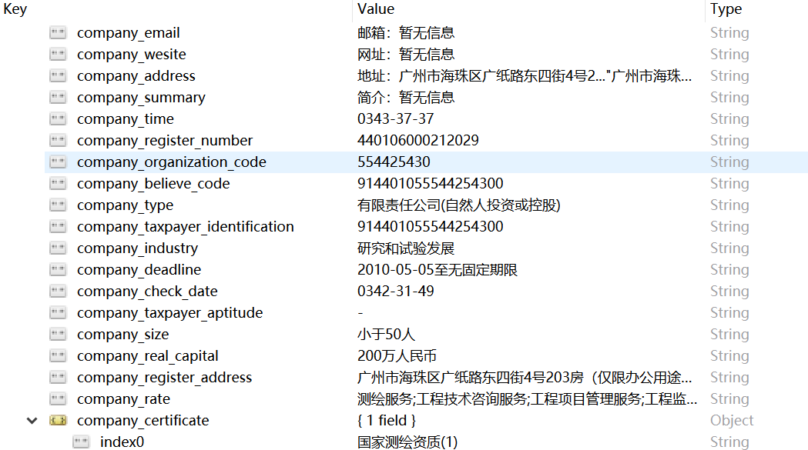

 Project-02 TianyanSpider
use the selenium and phantomjs tools implements crawl tianyan companies datas and store into mongodb.																		
#### Hisory Version

+ 2018-08-07
  
  实现：公司基本信息包括，网址、注册时间、注册地点、法定代表人、经营范围、公司规模、公司专利、软件著作权、招标等信息
  
  缺点：爬虫速度过快、爬取数据量过大易引起天眼查的反爬策略，常见的为验证码问题以及账号登入问题。由于请求的数据多达2万条，总体爬虫效率较低，爬虫速度待改进。
 
  样例数据: 
           
    
  
